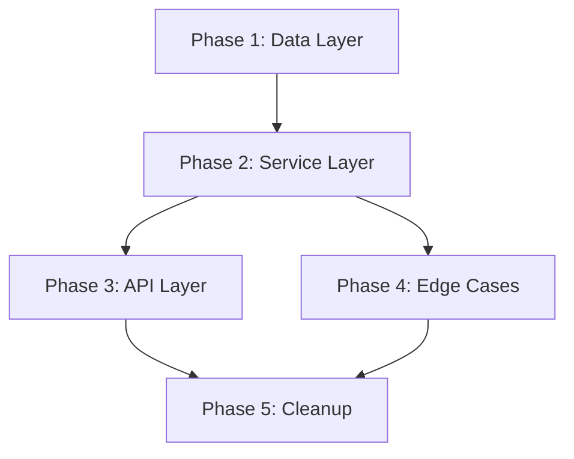

# Implementation Plan Generator

Transform an approved specification into a detailed, actionable implementation plan. The plan defines **how** to build the feature, **what files** to create or modify, **in what order**, and **what risks** to watch for.

This is Phase 2 of the spec-driven pipeline: **Spec → Plan → Tasks → Implement**.

## CRITICAL RULES

1. **Always start from a spec.** Never generate a plan from a vague description. If no spec exists, tell the user to run `/spec-gen` first.
2. **Ground the plan in the actual codebase.** Read existing code to understand patterns, conventions, and architecture before proposing changes.
3. **Every plan item must trace back to an acceptance criterion** in the spec. If a plan item doesn't serve any AC, it's scope creep — remove it.
4. **TDD by default.** Tests are written before implementation code. Every phase starts with test definitions.

---

## Phase 1 — Load Context

### 1.1 Read the Spec

Read the spec file provided as argument. Extract:
- All acceptance criteria (these drive the plan)
- Business rules (these constrain the plan)
- Data requirements (these shape the data layer)
- Constraints (security, performance, compliance)
- Edge cases (these become test cases)
- Dependencies (these determine ordering)

If the spec has unresolved open questions (status: pending), **stop** and tell the user to resolve them first. A plan built on ambiguity is a plan for rework.

### 1.2 Understand the Current Codebase

```
Glob: CLAUDE.md
```
Read project conventions.

Scan the codebase to understand:

**Architecture pattern:**
```bash
ls -la src/ app/ lib/ packages/ 2>/dev/null
tree -L 2 -d src/ 2>/dev/null || tree -L 2 -d app/ 2>/dev/null
```

**Existing patterns for similar features:**
```
Grep for route definitions, service classes, model definitions,
test files — to understand what conventions exist
```

**Recent changes (for context):**
```bash
git log --oneline -15
```

**Test patterns:**
```
Glob: **/*.test.*, **/*.spec.*, **/test_*.py, **/*_test.go
```
Read 1-2 test files to understand the testing conventions.

### 1.3 Read Existing Plans

```
Glob: specs/*/plan.md, .specify/specs/**/plan.md
```

If other plans exist, read them to maintain consistent format and conventions.

---

## Phase 2 — Architectural Analysis

Before writing the plan, determine:

### 2.1 Impact Assessment

For each acceptance criterion, identify:
- Which existing modules/files need to change
- What new modules/files need to be created
- What external services or APIs are involved
- What database changes are needed (migrations, new tables, new columns)

```
Grep for relevant domain terms from the spec in the codebase
to find existing related code
```

### 2.2 Dependency Mapping

Build a dependency graph of the changes:
- What must be built first? (usually: data layer → service layer → API layer → UI)
- Are there circular dependencies?
- Can anything be built in parallel?

### 2.3 Risk Identification

Flag risks that could derail implementation:
- **Breaking changes** — Will this modify existing APIs or data structures?
- **Migration risk** — Does the database change need a migration strategy?
- **Integration risk** — Does this depend on external services with uncertain behavior?
- **Performance risk** — Will this affect query performance or memory usage?
- **Security risk** — Does this introduce new attack surfaces?

---

## Phase 3 — Write the Plan

Create the plan file at: `specs/<NNN>-<feature-slug>/plan.md` (same directory as the spec)

### Plan Template

```markdown
# Implementation Plan: <Feature Title>

> **Spec:** [<Spec ID> - <Title>](spec.md)
> **Status:** DRAFT | IN REVIEW | APPROVED
> **Created:** <date>
> **Estimated effort:** <T-shirt size: S/M/L/XL>

---

## 1. Summary

<2-3 sentences describing the implementation approach at a high level>

## 2. Architecture Decisions

Decisions made to implement the spec. Each decision should note alternatives considered and why this approach was chosen.

| # | Decision | Rationale | Alternatives Considered |
|---|----------|-----------|------------------------|
| AD-1 | <decision> | <why> | <what else was considered> |
| AD-2 | <decision> | <why> | <what else was considered> |

## 3. Acceptance Criteria Traceability

Every AC from the spec must map to at least one implementation phase:

| AC | Description | Implemented In | Tested In |
|----|-------------|----------------|-----------|
| AC-1 | <from spec> | Phase X | Phase X (tests) |
| AC-2 | <from spec> | Phase X | Phase X (tests) |

## 4. Implementation Phases

### Phase 1: Data Layer

**Goal:** <what this phase achieves>
**Traces to:** AC-1, AC-3, BR-2

#### Tests First
| Test | Type | File | Validates |
|------|------|------|-----------|
| <test name> | unit | <test file path> | <what it proves> |

#### Changes
| Action | File | Description |
|--------|------|-------------|
| CREATE | <file path> | <what and why> |
| MODIFY | <file path> | <what changes and why> |

#### Migration (if applicable)
- Migration name: `<descriptive_name>`
- Reversible: YES / NO
- Data impact: <what happens to existing data>

---

### Phase 2: Service / Business Logic Layer

**Goal:** <what this phase achieves>
**Traces to:** AC-2, AC-4, BR-1

#### Tests First
| Test | Type | File | Validates |
|------|------|------|-----------|
| <test name> | unit | <test file path> | <what it proves> |
| <test name> | integration | <test file path> | <what it proves> |

#### Changes
| Action | File | Description |
|--------|------|-------------|
| CREATE | <file path> | <what and why> |
| MODIFY | <file path> | <what changes and why> |

---

### Phase 3: API / Controller Layer

**Goal:** <what this phase achieves>
**Traces to:** AC-1, AC-2, AC-5

#### Tests First
| Test | Type | File | Validates |
|------|------|------|-----------|
| <test name> | integration | <test file path> | <what it proves> |
| <test name> | contract | <test file path> | <what it proves> |

#### Changes
| Action | File | Description |
|--------|------|-------------|
| CREATE | <file path> | <what and why> |
| MODIFY | <file path> | <what changes and why> |

#### New Endpoints
| Method | Path | Auth | Description |
|--------|------|------|-------------|
| POST | /api/... | Required | <what it does> |

---

### Phase 4: Integration & Edge Cases

**Goal:** Wire everything together, handle edge cases from spec
**Traces to:** Edge cases 1-N from spec

#### Tests First
| Test | Type | File | Validates |
|------|------|------|-----------|
| <test name> | E2E | <test file path> | <what it proves> |

#### Edge Case Handling
| Edge Case (from spec) | Handling Approach | Test |
|----------------------|-------------------|------|
| <scenario> | <how it's handled> | <test name> |

---

### Phase 5: Cleanup & Documentation

**Goal:** Finalize, document, remove TODOs

#### Changes
| Action | File | Description |
|--------|------|-------------|
| MODIFY | <API docs> | Add new endpoint documentation |
| MODIFY | <README/changelog> | Update with feature description |

## 5. File Change Summary

Complete list of all files touched, for PR review planning:

| File | Action | Phase | Lines (est.) |
|------|--------|-------|-------------|
| <file path> | CREATE | 1 | ~50 |
| <file path> | MODIFY | 2 | ~20 |

**Total files:** <N> (<N> new, <N> modified)
**Estimated total lines:** ~<N>

## 6. Risks & Mitigations

| Risk | Severity | Likelihood | Mitigation |
|------|----------|-----------|------------|
| <risk> | HIGH/MED/LOW | HIGH/MED/LOW | <how to mitigate> |

## 7. Rollback Plan

If this feature needs to be reverted:
- <step 1: what to undo>
- <step 2: database rollback if applicable>
- <step 3: feature flag to disable if applicable>

## 8. Dependencies & Ordering



External dependencies that must be ready:
- <external service/team/API that must be available>

---

> **Next step:** When this plan is APPROVED, run `/task-gen specs/<NNN>-<feature-slug>/plan.md` to break it into implementable tasks.
```

---

## Phase 4 — Plan Validation

### 4.1 Traceability Check

Every acceptance criterion from the spec must appear in at least one phase. If an AC is not covered, either the plan is incomplete or the AC should be moved to a future spec.

### 4.2 File Existence Check

For every MODIFY action, verify the file actually exists:
```
Glob: <each file path listed as MODIFY>
```
Flag any file that doesn't exist — either the path is wrong or it should be CREATE.

### 4.3 Convention Check

Verify the plan follows existing codebase conventions:
- Are new files placed in the right directories?
- Do new test files follow the existing test naming pattern?
- Do new endpoints follow the existing route pattern?

### 4.4 Feasibility Check

- Is estimated effort reasonable for the number of changes?
- Are there any phases that seem too large? (If >10 file changes in one phase, consider splitting)
- Are tests defined for every non-trivial change?

---

## Output

1. **Primary:** `specs/<NNN>-<feature-slug>/plan.md` — The implementation plan
2. **Console summary:** Phase count, file count, estimated effort, risk summary
3. **Next action:** Remind the user to review the plan, then run `/task-gen`