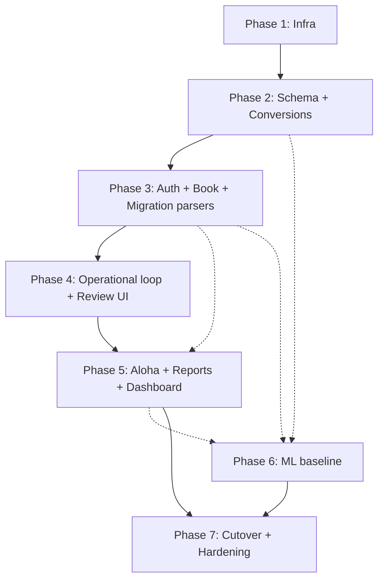

# Implementation Plan — TP Manager

> **Spec:** [.sdlc/product-owner/feature-intake/spec.md](../../product-owner/feature-intake/spec.md) **v1.6** (APPROVED — Docker-first, EN-only)
> **Design review:** [design-review.md](./design-review.md)
> **Status:** DRAFT (pending plan-to-tasks quality gate + HITL)
> **Created:** 2026-04-17
> **Revised:** 2026-04-17 (v1.6 scope trim — Docker deployment unit formalized; bilingual EN/ES removed)
> **Estimated effort:** XL — 16–22 engineering-weeks (v1.6: ~1 wk shaved by dropping bilingual), 2–3 person team (1 TS full-stack, 1 Python/data, 0.5 designer/QA)

---

## 1. Summary

Build the **21-module MVP (spec v1.6)** in **seven phases over 10 waves**, starting with infrastructure + data layer and ending with the forecast UI + cutover. The critical path is: infra → schema + conversions → auth + RBAC → ingredients/recipes + migration → inventory/prep/waste → Aloha import → ML baseline → reports/dashboard → PWA polish → cutover. ML is a separable work stream that runs in parallel from Wave 5 onward — operational modules never block on ML.

Deployment unit is **Docker**: every service ships a `Dockerfile`, local dev runs `docker-compose up`, production runs the same images on Azure Container Apps.

The plan is explicit about ten architectural decisions the design review flagged. Each ships as an ADR in `docs/adr/` at the phase it first bites.

---

## 2. Architecture Decisions (to be formalized as ADRs during Phase 1)

| # | Decision | Rationale | Alternatives Considered | ADR file |
|---|----------|-----------|------------------------|----------|
| AD-1 | **Azure Container Apps** (not raw VM) running Docker images for the three services | Meets 99.5% availability NFR without a hot-standby VM; Azure handles patches/restarts; cost ≈ one E2s_v5 VM. Runtime takes whatever Docker images CI produces, so switching away from Container Apps is a deploy-pipeline change, not a rewrite (v1.6). | (a) Single Azure VM (rejected — availability risk per design-review HIGH #1); (b) Dual-VM with Front Door (rejected — operational overhead for MVP scale). | `docs/adr/0001-container-apps-over-vm.md` |
| AD-2 | **NestJS** for API service | Opinionated structure, built-in OpenAPI generation, DI fits the layered services described in spec §10, LTS support. | Fastify (rejected — faster but less structure; team would re-invent layering). | `docs/adr/0002-api-framework-nestjs.md` |
| AD-3 | **Scheduled PMIX file-drop** (path a) for Aloha | Owner already produces this exact report; zero Aloha-side development; parser already validated against sample. | (b) SFTP DBF pickup (rejected — DBF encoding + schema volatility); (c) Aloha Cloud REST (rejected — owner is on classic on-prem); (d) Middleware (rejected — monthly subscription cost). Transport isolated behind interface so reversible. | `docs/adr/0003-aloha-transport-pmix-filedrop.md` |
| AD-4 | **Dedicated `conversions` module** with property-based tests | Three conversion layers stacked (weight↔volume, utensil→physical, per-ingredient override). Scattering this across call sites is a silent wrong-cost farm (design-review MEDIUM #3). | In-line conversion at cost-compute sites (rejected — prevents centralized property tests). | `docs/adr/0004-conversions-module.md` |
| AD-5 | **Row-level DB triggers** for audit log | App-layer hooks bypassed by ops/backfill SQL; schema drift risk but trigger template is generated per audited table (design-review MEDIUM #7). | Application-level hooks (rejected — bypassable). | `docs/adr/0005-audit-log-db-triggers.md` |
| AD-6 | **JWT-only `/api/v1`**; PWA uses httpOnly refresh cookie + access-token in Authorization header | Eliminates CSRF vs JWT middleware overlap; native clients use same contract (design-review LOW #8). | Hybrid cookies + JWT (rejected — dual-middleware complexity, subtle security gaps). | `docs/adr/0006-auth-jwt-only-api.md` |
| AD-7 | **Transactional Aloha batches** — full parse then single transaction per business_date | Eliminates "last import wins" partial-failure ambiguity (design-review MEDIUM #4). | Streaming insert (rejected — partial-failure leaves ambiguous state). | `docs/adr/0007-aloha-transactional-ingest.md` |
| AD-8 | **ML artefact hot-cached on service start + DB NOTIFY on model_version change** | Avoids cold-load blob fetch per request; staleness bounded by NOTIFY propagation (design-review MEDIUM #5). | Cache on first request (rejected — slow first hit); no cache (rejected — blob latency per call). | `docs/adr/0008-ml-artefact-caching.md` |
| AD-9 | **Monorepo (pnpm workspaces)** with `apps/web`, `apps/api`, `apps/aloha-worker`, `services/ml` (Python), `packages/types`, `packages/conversions` | Shared TypeScript types across web + API + worker; Python ML is a separate workspace-peer with its own lockfile. | Polyrepo (rejected — type sync friction); single TS monorepo without Python-peer (rejected — Python must live somewhere). | `docs/adr/0009-monorepo-layout.md` |
| AD-10 | **Docker is the unit of deployment and local dev** — one multi-stage `Dockerfile` per app/service (`apps/api`, `apps/web`, `apps/aloha-worker`, `services/ml`); root `docker-compose.yml` brings up API + ML + Aloha worker + Postgres 16 + MinIO (local Blob) + nginx in one command; CI builds the same images that ship to prod | Single artefact across dev and prod removes "works on my laptop"; local stack matches prod topology; production hosting runtime is swappable (v1.6 owner requirement). | (a) systemd on a VM with tarballs (rejected — env drift, availability gap); (b) PaaS buildpacks (rejected — loses Python ML + TS monorepo flexibility). | `docs/adr/0010-docker-deployment-unit.md` |

---

## 3. Acceptance-Criteria Traceability

AC IDs are per-module indices within their `§6.X` section in the spec.

| Spec section | AC count | Implemented in phase | Primary test phase |
|---|---|---|---|
| §6.1 Ingredients | 6 ACs + 3 edge cases | Phase 3 (Wave 4) | Phase 3 + Phase 7 (E2E) |
| §6.2 Suppliers | 5 ACs + 1 edge case | Phase 3 (Wave 4) | Phase 3 |
| §6.3 Recipes | 8 ACs + 3 edge cases | Phase 3 (Waves 4–5) | Phase 3 |
| §6.3a Portion utensils + pre-portioning | 6 ACs + 4 edge cases | Phase 2 (Wave 2) + Phase 3 (Wave 5) | Phase 2 (property tests) + Phase 3 |
| §6.3b Station cheat-sheet views | 5 ACs + 2 edge cases | Phase 3 (Wave 5) | Phase 3 |
| §6.4 Daily Prep Sheet | 6 ACs | Phase 4 (Wave 6) | Phase 4 |
| §6.5 Inventory Count | 5 ACs | Phase 4 (Wave 6) | Phase 4 |
| §6.6 Deliveries | 5 ACs | Phase 4 (Wave 6) | Phase 4 |
| §6.7 Order Forms | 4 ACs | Phase 4 (Wave 7) | Phase 4 |
| §6.8 Waste Log | 4 ACs | Phase 4 (Wave 7) | Phase 4 |
| §6.9 Reports | matrix (3 reports) | Phase 5 (Wave 8) | Phase 5 |
| §6.10 Dashboard | KPI list | Phase 5 (Wave 8) | Phase 5 + E2E |
| §6.11 Settings | list | Phase 3 (Wave 4) | Phase 3 |
| §6.12a Aloha PMIX | 8 ACs + 6 edge cases | Phase 5 (Wave 8) | Phase 5 (includes PMIX-fixture tests) |
| §6.12b ML baseline | 9 ACs + 3 edge cases | Phase 6 (Waves 6–9 parallel) | Phase 6 + forecast-accuracy dashboard |
| §6.13 Auth & RBAC | 4 ACs | Phase 2 (Wave 3) | Phase 2 |
| §6.14 Migration tool | 10 ACs + 4 edge cases | Phase 3 (Wave 5) — staging parsers in Wave 5; review UI in Wave 7 | Phase 3 + Phase 7 (dry-run drill) |
| §7 NFRs | 12 items | Cross-cutting + Phase 7 (Wave 10) | Phase 7 (perf, a11y, security audits) |
| §15 DoD (10 items) | — | Phase 7 (Wave 10) | — |

Gate check: **every AC has ≥ 1 phase**. No orphans.

---

## 4. Implementation Phases

Waves are the task-gen scheduling unit. Multiple phases can overlap waves because they're staffed separately (operational vs ML).

### Phase 1 — Infrastructure & Repo Scaffold (Wave 1; ~1 week)

**Goal:** The repo + cloud skeleton is ready to deploy "hello world" Docker images to Azure Container Apps, and `docker-compose up` brings up the full stack locally. Every subsequent phase deploys into this chassis.
**Traces to:** §7 NFR infra/security/observability, §10 architecture, AD-1, AD-2, AD-9, **AD-10**

#### Tests first
| Test | Type | File | Validates |
|---|---|---|---|
| `infra_deploys_ok` | smoke | `ops/smoke/health.http` | Each service `/healthz` returns 200 from Front Door |
| `secret_rotates_without_redeploy` | manual-runbook | `ops/runbooks/secret-rotation.md` | Key Vault → Container App env ref refresh |
| `docker_compose_up_ok` | smoke | `ops/smoke/compose-up.sh` | `docker-compose up -d` → all containers healthy within 60 s; `/healthz` reachable on every service (AD-10) |
| `docker_image_reproducible` | CI | `.github/workflows/ci.yml` | CI rebuild produces identical SHA for unchanged source (digest pinning) |

#### Changes
| Action | File | Description |
|---|---|---|
| CREATE | `pnpm-workspace.yaml`, `package.json`, `turbo.json` | Monorepo chassis (AD-9) |
| CREATE | `apps/web/`, `apps/api/`, `apps/aloha-worker/`, `services/ml/`, `packages/types/`, `packages/conversions/` | Workspace skeletons |
| CREATE | `apps/web/Dockerfile`, `apps/api/Dockerfile`, `apps/aloha-worker/Dockerfile`, `services/ml/Dockerfile` | One multi-stage Dockerfile per service (AD-10) — non-root user, distroless / slim base, healthcheck |
| CREATE | `docker-compose.yml`, `docker-compose.override.yml` | Root compose file: API + ML + worker + Postgres 16 + MinIO + nginx; override for dev-only bind mounts (AD-10) |
| CREATE | `.dockerignore` | Exclude node_modules, .git, fixtures from build context |
| CREATE | `ops/iac/` (Bicep or Terraform) | Resource group, Container Apps environment, Flexible-server PG (+ read replica), Blob, Key Vault, Front Door, managed identities; Container Apps pull from ACR-hosted images |
| CREATE | `ops/ci/.github/workflows/` | PR CI (lint + typecheck + test + docker-build matrix), deploy workflows (main → staging ACR+Container Apps, tag → prod) |
| CREATE | `docs/adr/0001..0010.md` | The 10 ADRs above |
| CREATE | `.env.example`, `CLAUDE.md` enrichment | Env contract and coding standards — project CLAUDE.md already exists |
| CREATE | `ops/observability/app-insights.json` | Log schema: service, level, correlation_id, user_id, entity_id |

#### Migrations
None yet (empty schema).

---

### Phase 2 — Data Layer & Core Conversions (Wave 2; ~2 weeks)

**Goal:** Schema, migrations, conversions module, and utensil catalogue seed. Everything above this phase consumes these shapes.
**Traces to:** §8 domain model, §6.3a AC-1/2/3/4, AD-4, AD-5, AD-7

#### Tests first
| Test | Type | File | Validates |
|---|---|---|---|
| `conversions.oz_to_g_roundtrip` | property | `packages/conversions/src/__tests__/weight.test.ts` | Weight ↔ weight is lossless within float tolerance |
| `conversions.volume_to_weight_with_density` | property | `.../volume_weight.test.ts` | Density required; missing density errors loudly, not silently |
| `conversions.utensil_chain` | property | `.../utensil.test.ts` | `2 × Blue Scoop(ingredient=granola)` picks override when present, falls back to utensil default otherwise |
| `db.audit_trigger_captures_update` | integration | `apps/api/test/audit.int.test.ts` | DB trigger writes audit_log row for UPDATE (AD-5) |
| `db.pos_sale_row_kind_discriminator` | integration | `.../pos_sale.int.test.ts` | CHECK constraint on row_kind |

#### Changes
| Action | File | Description |
|---|---|---|
| CREATE | `apps/api/prisma/schema.prisma` (or drizzle schema) | All §8 entities |
| CREATE | `apps/api/prisma/migrations/0001_init.sql` | Initial migration |
| CREATE | `apps/api/prisma/migrations/0002_audit_triggers.sql` | Audit trigger template applied per table (AD-5) |
| CREATE | `apps/api/seed/portion_utensils.ts` | Seed the 8 utensils from §6.3a AC-2 |
| CREATE | `packages/conversions/src/index.ts` | Pure conversion module: weight↔volume, utensil↔physical, per-ingredient overrides |
| CREATE | `packages/conversions/src/densities.ts` | Density table (ingredient_id → g/mL) |
| CREATE | `packages/types/src/domain.ts` | TS types mirroring §8 entities — shared across apps |

#### Migration
- Name: `0001_init`
- Reversible: YES (drop all created tables)
- Data impact: empty; canonical tables ready for Phase 3 migration tool

---

### Phase 3 — Auth, Ingredients, Suppliers, Recipes, Migration Parsers (Waves 3–5; ~4 weeks)

**Goal:** The "book" half of the system. After this phase, the spec's 11 source files can be loaded into staging, reviewed, and promoted — and the PWA can render recipes correctly.
**Traces to:** §6.1, §6.2, §6.3, §6.3a, §6.3b, §6.11, §6.13, §6.14, AD-2, AD-6

#### Wave 3 — Auth + RBAC (~1 week)
**Tests first**
| Test | Type | File | Validates |
|---|---|---|---|
| `auth.argon2_hash_verify` | unit | `apps/api/src/auth/__tests__/password.test.ts` | argon2 hash + verify |
| `auth.jwt_issue_and_refresh` | unit | `.../tokens.test.ts` | JWT + refresh rotation (AD-6) |
| `auth.rbac_owner_can_edit_recipe` | integration | `.../rbac.int.test.ts` | owner passes, staff 403 |
| `auth.rate_limit_login` | integration | `.../rate_limit.int.test.ts` | >5/min locks |

**Changes**
| Action | File | Description |
|---|---|---|
| CREATE | `apps/api/src/auth/` | argon2, JWT, refresh, forgot-password flow |
| CREATE | `apps/api/src/rbac/` | Role guard, decorator `@Roles('owner')` |
| CREATE | `apps/web/src/auth/` | Login, forgot-password screens; PWA stores access JWT in memory, refresh cookie httpOnly |

#### Wave 4 — Ingredients, Suppliers, Settings (~1.5 weeks)
**Tests first (sample)**
| Test | Type | File | Validates |
|---|---|---|---|
| `ingredients.list_search_filter` | integration | `apps/api/src/ingredients/__tests__/list.int.test.ts` | §6.1 AC-1 |
| `ingredients.soft_archive_if_referenced` | integration | `.../archive.int.test.ts` | §6.1 AC-4 |
| `suppliers.ranked_offers` | integration | `apps/api/src/suppliers/__tests__/ranked.int.test.ts` | §6.2 AC-3 |
| `ingredient_csv_import_export` | integration | `apps/api/src/ingredients/__tests__/csv.int.test.ts` | §6.1 AC-5 |

**Changes**
| Action | File | Description |
|---|---|---|
| CREATE | `apps/api/src/ingredients/` | Module — controller, service, repo, DTOs |
| CREATE | `apps/api/src/suppliers/` | Module |
| CREATE | `apps/api/src/settings/` | Locations, UoMs, utensils, stations, waste reasons, par levels |
| CREATE | `apps/web/src/pages/ingredients/`, `/suppliers/`, `/settings/` | PWA screens (English-only per spec v1.6) |

#### Wave 5 — Recipes (prep + menu), Station views, Migration parsers (~1.5 weeks)
**Tests first (sample)**
| Test | Type | File | Validates |
|---|---|---|---|
| `recipe.nested_bom_cost` | unit | `apps/api/src/recipes/__tests__/bom.test.ts` | §6.3 AC-4 — plated cost via nested BOM |
| `recipe.cycle_detection` | unit | `.../cycle.test.ts` | §6.3 AC-8 — a prep can't transitively include itself |
| `recipe.version_pin_cost` | integration | `.../version.int.test.ts` | §6.3 AC-5 — historical cost pins to the version active at the time |
| `recipe.utensil_line_cost` | unit | `.../utensil_line.test.ts` | §6.3a AC-3/4 |
| `recipe.station_view_render` | integration | `apps/api/src/recipes/__tests__/station.int.test.ts` | §6.3b AC-2/3 |
| `migration.recipe_book_parser_fixture` | unit | `apps/api/src/migration/parsers/__tests__/recipe_book.test.ts` | Parses a known `TP Recipe Book.xlsx` sample |
| `migration.pmix_parser_fixture` | unit | `apps/api/src/migration/parsers/__tests__/aloha_pmix.test.ts` | Classifies items/modifiers/86/covers from `myReport (10).xlsx` |
| `migration.atomic_batch` | integration | `apps/api/src/migration/__tests__/atomic.int.test.ts` | AD-7 — parse-all-then-insert, failure → zero rows |

**Changes**
| Action | File | Description |
|---|---|---|
| CREATE | `apps/api/src/recipes/` | Module — nested BOM resolver, cycle detector, plated-cost calculator *using* `packages/conversions` |
| CREATE | `apps/api/src/migration/parsers/` | One parser per source type (§6.14 AC-3); each reads a file → staging rows |
| CREATE | `apps/api/src/migration/` | Staging schema writers, dedupe engine, similarity scorer with explanation |
| CREATE | `apps/web/src/pages/recipes/`, `/recipes/station/:station/` | Recipe CRUD + printable cheat-sheet PDF (on-demand, via `@react-pdf/renderer` or similar) |
| CREATE | `ops/fixtures/source-files/` | Pinned source files for parser tests (gitignored if large — use a public Azure Blob with SAS) |

---

### Phase 4 — Operational Loop: Prep Sheet, Inventory, Deliveries, Orders, Waste (Waves 6–7; ~3 weeks)

**Goal:** The daily operational rhythm works end-to-end: morning prep sheet → inventory counts → deliveries in → orders out → waste logged continuously.
**Traces to:** §6.4, §6.5, §6.6, §6.7, §6.8, §6.14 (review UI lands here in Wave 7)

#### Wave 6 — Prep Sheet + Inventory + Deliveries (~1.5 weeks)
**Tests first (sample)**
| Test | Type | File | Validates |
|---|---|---|---|
| `prep.generate_from_par_and_onhand` | unit | `apps/api/src/prep/__tests__/generate.test.ts` | §6.4 AC-2 |
| `prep.complete_increments_onhand` | integration | `.../complete.int.test.ts` | §6.4 AC-4 |
| `inventory.resume_midway` | integration | `apps/api/src/inventory/__tests__/resume.int.test.ts` | §6.5 AC-4 |
| `inventory.amend_creates_new_count` | integration | `.../amend.int.test.ts` | §6.5 AC-5 |
| `delivery.verify_updates_cost_history` | integration | `apps/api/src/deliveries/__tests__/verify.int.test.ts` | §6.6 AC-4 |

#### Wave 7 — Orders + Waste + Migration review UI (~1.5 weeks)
**Tests first (sample)**
| Test | Type | File | Validates |
|---|---|---|---|
| `orders.compute_to_order_rounded_to_pack` | unit | `apps/api/src/orders/__tests__/compute.test.ts` | §6.7 AC-1 |
| `waste.partial_portion_bag` | integration | `apps/api/src/waste/__tests__/partial.int.test.ts` | §6.3a edge case — partial-use of a portion bag |
| `waste.expired_suggestion_on_dashboard` | integration | `apps/web/src/pages/__tests__/dashboard.int.test.ts` | §6.8 AC-4 |
| `migration.review_approve_promotes_batch` | integration | `apps/api/src/migration/__tests__/review.int.test.ts` | §6.14 AC-6 |
| `migration.rollback_within_14d` | integration | `.../rollback.int.test.ts` | §6.14 AC-7 |

**Changes** (Waves 6+7 combined)
| Action | File | Description |
|---|---|---|
| CREATE | `apps/api/src/prep/`, `src/inventory/`, `src/deliveries/`, `src/orders/`, `src/waste/` | Modules |
| CREATE | `apps/web/src/pages/prep/sheet`, `/inventory`, `/deliveries`, `/orders`, `/prep/waste` | PWA screens |
| CREATE | `apps/api/src/migration/review/` | Review queue endpoints: new / matched / ambiguous / unmapped buckets |
| CREATE | `apps/web/src/pages/settings/migration/` | Review UI with "why this match" explanation (§6.14 AC-5) |

---

### Phase 5 — Aloha PMIX, Reports, Dashboard (Wave 8; ~2 weeks)

**Goal:** POS reality lands in the system; reports become real; dashboard KPIs go from placeholder to live.
**Traces to:** §6.9, §6.10, §6.12a, AD-3, AD-7

#### Tests first
| Test | Type | File | Validates |
|---|---|---|---|
| `aloha.import_run_idempotent` | integration | `apps/aloha-worker/test/idempotent.int.test.ts` | §6.12a AC-6 |
| `aloha.classifies_row_kinds` | unit | `apps/aloha-worker/test/classify.test.ts` | item / modifier / stockout_86 / cover / unclassified |
| `aloha.modifier_consumes_ingredient` | integration | `.../modifier_bom.int.test.ts` | §6.12a AC-4 |
| `aloha.86_increments_stockout_event` | integration | `.../stockout.int.test.ts` | §6.12a AC-3 |
| `aloha.gap_surfaces_dashboard_warning` | integration | `apps/web/src/pages/__tests__/dashboard_gap.int.test.ts` | §6.12a AC-7 |
| `reports.avt_variance_computation` | integration | `apps/api/src/reports/__tests__/variance.int.test.ts` | §6.9 AvT |
| `reports.price_creep_threshold` | integration | `.../price_creep.int.test.ts` | §6.9 Price Creep |

#### Changes
| Action | File | Description |
|---|---|---|
| CREATE | `apps/aloha-worker/src/` | Scheduled ingest (cron via Container Apps), PMIX parser reused from Phase 3, transactional insert (AD-7), menu + modifier mapping |
| CREATE | `apps/api/src/aloha/mapping/` | Reconciliation queue endpoints |
| CREATE | `apps/web/src/pages/settings/aloha-mapping/` | Menu + modifier mapping UI |
| CREATE | `apps/api/src/reports/` | AvT, Price Creep, Waste report endpoints |
| CREATE | `apps/web/src/pages/reports/variance`, `/reports/price-creep`, `/reports/waste`, `/` (dashboard) | Report + dashboard screens |
| CREATE | `apps/aloha-worker/src/heartbeat.ts` | Emit heartbeat metric per run (design-review LOW #9) |

---

### Phase 6 — ML Baseline (Waves 6–9 in parallel with operational work; ~4 weeks staffed ~0.6 FTE Python)

**Goal:** Ingredient demand + prep qty recommendations served from trained baseline models, with accuracy dashboard.
**Traces to:** §6.12b, §9, AD-8

This phase is a **separable work stream**. Operational phases do not depend on it; if it slips, MVP ships with "insufficient data" UI (§6.12b AC-7).

#### Tests first
| Test | Type | File | Validates |
|---|---|---|---|
| `ml.holt_winters_baseline` | unit | `services/ml/tests/test_hw.py` | Trains on a synthetic seasonal series; MAPE < known baseline |
| `ml.seasonal_naive_baseline` | unit | `.../test_seasonal_naive.py` | Picks same-day-of-week-last-year correctly |
| `ml.model_selection_per_item` | unit | `.../test_selection.py` | 8-week holdout MAPE drives model pick |
| `ml.artefact_cache_reloads_on_notify` | integration | `.../test_artefact_cache.py` | AD-8 — NOTIFY triggers in-process reload |
| `ml.forecast_endpoint_returns_intervals` | integration | `.../test_api.py` | §6.12b AC-1 — point + p10/p90 |
| `ml.cold_start_uses_4w_mean` | integration | `.../test_cold_start.py` | §6.12b AC-6 |

#### Changes
| Action | File | Description |
|---|---|---|
| CREATE | `services/ml/` | FastAPI app — `/forecast/ingredient/:id`, `/forecast/prep/:id` |
| CREATE | `services/ml/training/` | Nightly job: reads from PG read replica, trains per-item Holt-Winters + seasonal-naïve, selects by holdout MAPE, writes artefact to Blob + `ForecastModel` row |
| CREATE | `services/ml/inference/` | Loads artefacts into memory on start, subscribes to PG NOTIFY `model_version_changed` |
| CREATE | `apps/api/src/forecast-proxy/` | TS API proxies forecast calls to ML service (critical path stays TS) |
| CREATE | `apps/web/src/components/ForecastBadge.tsx` | Confidence + "last updated N days ago" |
| CREATE | `apps/web/src/pages/reports/forecast-accuracy/` | Forecast-accuracy dashboard |

---

### Phase 7 — Cutover, Hardening, Docs (Wave 10; ~2 weeks)

**Goal:** Meet all NFRs, run DR drill, cut over the owner, retire source files.
**Traces to:** §7 all NFRs, §15 DoD

#### Tests / audits
| Activity | Artifact | Validates |
|---|---|---|
| Lighthouse + WebPageTest pass on 4G throttling | `ops/reports/perf-YYYY-MM-DD.md` | §7 FCP < 2s, list render < 500ms |
| axe + manual a11y sweep on top 5 screens | `ops/reports/a11y-YYYY-MM-DD.md` | §7 WCAG 2.1 AA |
| OWASP ZAP baseline + `/security-audit` | `ops/reports/security-YYYY-MM-DD.md` | §7 OWASP Top 10, §11 |
| Restore drill from PG PITR | `ops/reports/restore-drill-YYYY-MM-DD.md` | design-review HIGH #2 |
| OpenAPI published | `apps/api/openapi.json` + `docs/api/` | §7 API NFR |
| Owner sign-off | DoD checklist | §15 DoD |

#### Changes
| Action | File | Description |
|---|---|---|
| MODIFY | `docs/api/`, `README.md` | Data dictionary + API reference |
| CREATE | `ops/runbooks/` | Daily-ops runbook, incident runbook, DR runbook |
| CREATE | `ops/cutover-plan.md` | Step-by-step cutover: migration dry-run in staging → owner UAT → prod promotion → monitor |

---

## 5. File-Change Summary (estimated)

| Area | New files | Modified files | Est. lines |
|---|---|---|---|
| IaC + CI (Phase 1) | ~20 | — | ~1500 |
| Schema + conversions (Phase 2) | ~25 | — | ~1200 |
| Auth + domain modules (Phase 3) | ~120 | — | ~7000 |
| Migration parsers + review (Phase 3 + 4) | ~30 | ~10 | ~3000 |
| Operational loop (Phase 4) | ~90 | ~20 | ~5000 |
| Aloha + reports + dashboard (Phase 5) | ~50 | ~20 | ~3000 |
| ML service (Phase 6) | ~30 | ~10 | ~2500 |
| Hardening + docs (Phase 7) | ~15 | ~40 | ~800 |
| **Total** | **~380 new** | **~100 modified** | **~24,000 lines** |

Single-phase >10-file caveats: Phase 3 Wave 5 and Phase 4 Wave 6 are each ≥ 20 files. Task-gen should split each wave into ≥ 3 tasks.

---

## 6. Risks & Mitigations (incremental to spec §13)

| Risk | Sev | Lik | Mitigation |
|---|---|---|---|
| Container Apps cold-start affects first request after idle | MED | HIGH | `minReplicas=1` for API service; ML service can scale-to-zero |
| pnpm + Python monorepo CI complexity | LOW | MED | Separate CI workflows per app/service; share only `packages/types` across TS |
| Parser fragility on source-file edits between migration attempts | MED | HIGH | §6.14 AC-1 staging isolation; new `batch_id` per attempt; parser version recorded in batch audit |
| Aloha schema shift (store patches their POS) | MED | MED | Parser is versioned; schema mismatch fails import with clear error (AD-7); owner alerted, no silent corruption |
| Conversion-module coverage gaps (missed edge case in utensil override) | MED | MED | Property-based tests with ≥ 1000 random pairs; every new ingredient requires at least one override row OR fallback marker |
| Forecast service feeds operational screens a stale prediction that looks fresh | LOW | MED | Every prediction renders `generated_at` next to the value; AD-8 NOTIFY ensures reload |
| Single-restaurant MVP masks multi-tenant assumptions | MED | MED | `restaurant_id` from day 1; lint rule blocks new queries without a `WHERE restaurant_id = ?` clause (custom ESLint rule on Prisma query builder) |
| DR drill finds broken restore process 2 weeks before cutover | MED | LOW | Schedule drill in Phase 7 Wave 10 — not launch week |

---

## 7. Rollback Plan

Per-phase rollback strategy. (Full launch rollback is covered by the cutover runbook.)

- **Phase 1–2 (infra + schema):** Destroy non-prod Container Apps env; restore PG from PITR. No user data yet.
- **Phase 3–4 (book + operational):** Feature-flag every route under `feature_flags.operational_module_X`; disable by flipping the flag in Key Vault. Database stays forward-compatible.
- **Phase 5 (Aloha):** Aloha worker is a separate Container App — stop the cron, promote last good dashboard snapshot. Import-run rows are append-only; rollback = archive and disable.
- **Phase 6 (ML):** `feature_flags.ml_enabled=false` falls the UI back to "insufficient data" for every forecast/recommendation. Artefacts remain in Blob.
- **Phase 7 (cutover):** §6.14 AC-7 provides a 14-day batch rollback for the migration itself. Owner can re-run migration without data loss.

---

## 8. Dependencies & Ordering

Solid = hard dependency; dashed = soft (data availability, not code).

### External dependencies that must be ready before each phase
- **Phase 1:** Azure subscription, resource-group naming, domain name (deferred OK).
- **Phase 3:** Access to all 11 source files (received; pinned to `ops/fixtures`).
- **Phase 5:** Scheduled PMIX export from Aloha dropping to the chosen target (SFTP / watched folder). Owner + tech lead configure before Wave 8.
- **Phase 5:** ≥ 90 days of recent PMIX history available for menu-mapping coverage target (DoD item 10).
- **Phase 6:** ≥ 1 year of backfilled PMIX in the canonical schema (happens in Phase 3 migration).
- **Phase 7:** Owner availability for UAT and sign-off (§15 DoD #8).

---

## 9. Wave Schedule (for task-gen)

| Wave | Phase(s) | Duration | Parallelism |
|---|---|---|---|
| 1 | Phase 1 | 1 wk | solo |
| 2 | Phase 2 | 2 wk | 1 TS + 1 reviewer |
| 3 | Phase 3 (auth) | 1 wk | 1 TS |
| 4 | Phase 3 (ingredients + suppliers + settings) | 1.5 wk | 1 TS |
| 5 | Phase 3 (recipes + station + migration parsers) | 1.5 wk | 1 TS full-stack + fixtures from data person |
| 6 | Phase 4 (prep + inventory + deliveries) // Phase 6 kickoff | 1.5 wk | 2 streams |
| 7 | Phase 4 (orders + waste + migration review UI) // Phase 6 training pipeline | 1.5 wk | 2 streams |
| 8 | Phase 5 (Aloha + reports + dashboard) // Phase 6 inference + accuracy dashboard | 2 wk | 2 streams |
| 9 | Phase 6 wrap + integration with operational screens | 1 wk | 1 stream |
| 10 | Phase 7 cutover & hardening | 2 wk | full team |
| | **Total** | **~15 wk critical path, ~18 wk with hardening buffer** (within 17–23 estimate) | |

---

## 10. Definition of Done (plan-level; DoD reproduces spec §15 v1.6)

1. All **21** in-scope modules shipped with AC met.
2. All 11 source files migrated through staging → review → canonical; ≥ 1 yr Aloha PMIX backfilled; ≥ 7 consecutive nightly imports working.
3. PWA install verified on iOS Safari + Android Chrome.
4. WCAG AA audit clean on top 5 screens.
5. Security review clean — zero critical, zero high.
6. Data dictionary + OpenAPI spec published.
7. Owner sign-off on dashboard KPIs.
8. Forecast baseline serving ≥ 80% of active ingredients + prep items; accuracy dashboard populated with ≥ 4 weeks of measured MAPE.
9. Aloha menu mapping ≥ 95% of last-90-day items.
10. **Every service ships a `Dockerfile`; `docker-compose up` at repo root brings the full stack up locally; production runs the same Docker images on Azure Container Apps (AD-10).**
11. *(added from design-review HIGH #2)* One full PG restore drill completed from PITR into a staging DB; timing measured; integrity check run.
12. *(added from design-review LOW #9)* Aloha worker heartbeat alerting configured in Application Insights.

---

> **Next step:** When this plan passes the `plan-to-tasks` quality gate (and any HITL), run `/run-pipeline developer/feature-build` (or `/task-gen` against this plan) to break each phase into implementable tasks.
