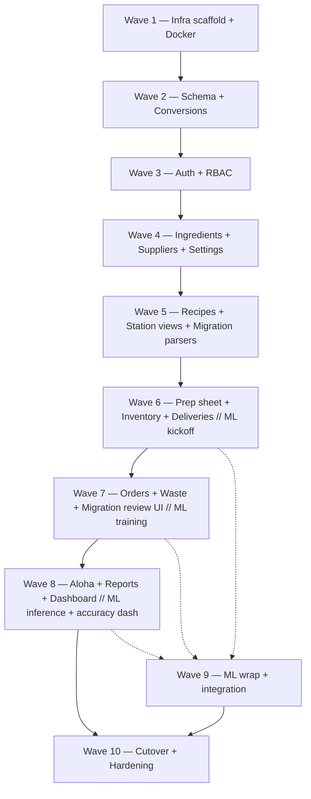

# Tasks: TP Manager — Restaurant Operations Platform

> **Spec:** [.sdlc/product-owner/feature-intake/spec.md](../../product-owner/feature-intake/spec.md) **v1.6** (APPROVED — Docker-first, EN-only)
> **Plan:** [.sdlc/architect/design-to-plan/plan.md](../../architect/design-to-plan/plan.md) (DRAFT — 7 phases / 10 waves, revised for v1.6)
> **Generated:** 2026-04-17
> **Total tasks:** 86
> **Estimated total effort:** ~16–22 engineering-weeks (2–3 person team: 1 TS full-stack, 1 Python/data, 0.5 designer/QA)

---

## How this file is organized

- Tasks are numbered TASK-001..TASK-086 and grouped by the plan's phase/wave.
- Each task traces to one or more ACs from the spec (§6.X) or plan DoD/ADR items.
- `Agent-ready: YES` means the task has a clearly defined test + code surface and can be executed by a sub-agent end-to-end. `PARTIAL` means agent can start but a human must review a judgment call. `NO` means the task needs a human (infra credentials, owner UAT, design decisions).
- Effort bands: XS < 30 min; S < 1 hr; M < 2 hr; L < 4 hr; XL = split further.
- Every IMPLEMENT task is preceded by a TEST task (TDD); test tasks sit in the same wave and block the implement task.

---

## Task Dependency Graph (high-level)

Solid = hard dependency; dashed = soft (parallel stream, data availability).

---

## Summary Table

| # | Task | Type | Wave | Depends on | Effort | AC/Ref | Agent |
|---|---|---|---|---|---|---|---|
| TASK-001 | Bootstrap pnpm monorepo skeleton (workspaces, turbo, package.json) | CONFIGURE | 1 | — | S | AD-9 | YES |
| TASK-002 | Create app/service skeletons (`apps/{web,api,aloha-worker}`, `services/ml`, `packages/{types,conversions}`) with stub `/healthz` | CONFIGURE | 1 | 001 | M | AD-9 | YES |
| TASK-003 | Write multi-stage `Dockerfile` for each service + `.dockerignore` | CONFIGURE | 1 | 002 | M | AD-10, DoD#10 | YES |
| TASK-004 | Write root `docker-compose.yml` + `docker-compose.override.yml` (API, ML, worker, Postgres 16, MinIO, nginx) | CONFIGURE | 1 | 003 | M | AD-10 | YES |
| TASK-005 | Smoke test: `docker_compose_up_ok` — compose up, all `/healthz` ≤ 60s | TEST | 1 | 004 | S | AD-10 | YES |
| TASK-006 | Smoke test: `docker_image_reproducible` — CI rebuild ⇒ identical digest on unchanged source | TEST | 1 | 003 | S | AD-10 | YES |
| TASK-007 | IaC: Bicep/Terraform for resource group, Container Apps env, Flexible-server PG + read replica, Blob, Key Vault, Front Door, managed identities | CONFIGURE | 1 | 002 | L | §10, AD-1 | PARTIAL (Azure creds) |
| TASK-008 | CI: PR workflow (lint + typecheck + unit) + docker-build matrix + push-to-ACR on main | CONFIGURE | 1 | 003, 007 | L | AD-1, AD-10 | YES |
| TASK-009 | Deploy workflow: main → staging Container Apps; tag → prod | CONFIGURE | 1 | 008 | M | AD-1 | PARTIAL (env secrets) |
| TASK-010 | Smoke test: `infra_deploys_ok` — `/healthz` from Front Door in staging | TEST | 1 | 009 | S | — | PARTIAL |
| TASK-011 | Write 10 ADRs (`docs/adr/0001..0010`) capturing the plan's architectural decisions | DOCUMENT | 1 | 002 | L | AD-1..AD-10 | YES |
| TASK-012 | Observability: `ops/observability/app-insights.json` log schema + correlation-id middleware scaffold | CONFIGURE | 1 | 002 | S | §7 observability | YES |
| TASK-013 | Feature-flag module: `feature_flags` table + Key Vault override resolver | IMPLEMENT | 1 | 002 | M | DEC-010 | YES |
| TASK-014 | `.env.example` + README quickstart (`docker-compose up` → login) | DOCUMENT | 1 | 004 | S | — | YES |
| TASK-015 | Property tests — weight↔weight roundtrip, volume↔weight with density, missing-density-errors-loudly | TEST | 2 | 002 | M | §6.1 AC-6, AD-4 | YES |
| TASK-016 | Property tests — utensil chain: default vs per-ingredient override | TEST | 2 | 015 | M | §6.3a AC-3/4 | YES |
| TASK-017 | Implement `packages/conversions` — pure functions, density table, utensil equivalences | IMPLEMENT | 2 | 015, 016 | L | AD-4 | YES |
| TASK-018 | Prisma (or drizzle) schema: all §8 entities incl. `restaurant_id` column | IMPLEMENT | 2 | 002 | L | §8, DEC-012 | YES |
| TASK-019 | Migration `0001_init.sql` (reversible) | MIGRATE | 2 | 018 | M | §8 | YES |
| TASK-020 | Integration test — audit trigger captures UPDATE (schema-level, not app-level) | TEST | 2 | 019 | M | AD-5 | YES |
| TASK-021 | Migration `0002_audit_triggers.sql` — row-level triggers per audited table, auto-generated template | MIGRATE | 2 | 020 | L | AD-5 | YES |
| TASK-022 | Integration test — `pos_sale.row_kind` CHECK constraint | TEST | 2 | 019 | S | §6.12a | YES |
| TASK-023 | Seed portion utensils (8 rows from §6.3a AC-2) | IMPLEMENT | 2 | 019 | XS | §6.3a AC-2 | YES |
| TASK-024 | `packages/types` — shared TS types mirroring §8 | IMPLEMENT | 2 | 018 | M | AD-9 | YES |
| TASK-025 | ESLint rule blocking queries without `restaurant_id` filter | CONFIGURE | 2 | 018 | M | DEC-012 | YES |
| TASK-026 | Tests — argon2 hash/verify; JWT issue + refresh rotation | TEST | 3 | 024 | M | §6.13, AD-6 | YES |
| TASK-027 | Tests — RBAC: owner vs manager vs staff route allowance | TEST | 3 | 026 | M | §6.13 AC-3 | YES |
| TASK-028 | Tests — login rate-limit (>5/min → 429) | TEST | 3 | 026 | S | §11 security | YES |
| TASK-029 | Implement `apps/api/src/auth` — argon2, JWT, refresh-cookie, forgot-password | IMPLEMENT | 3 | 026, 027, 028 | L | §6.13, AD-6 | YES |
| TASK-030 | Implement `apps/api/src/rbac` — role guard + `@Roles()` decorator | IMPLEMENT | 3 | 029 | M | §6.13 | YES |
| TASK-031 | PWA auth screens (login, forgot-password) + in-memory access JWT store | IMPLEMENT | 3 | 029 | M | §6.13, AD-6 | YES |
| TASK-032 | Tests — ingredient list search/filter; soft-archive-when-referenced; CSV in/out | TEST | 4 | 021 | M | §6.1 | YES |
| TASK-033 | Implement ingredients module (controller, service, repo, DTOs) | IMPLEMENT | 4 | 032 | L | §6.1 | YES |
| TASK-034 | Tests — supplier CRUD; ranked offers; price-creep event trail | TEST | 4 | 021 | M | §6.2 | YES |
| TASK-035 | Implement suppliers module | IMPLEMENT | 4 | 034 | M | §6.2 | YES |
| TASK-036 | Implement settings module (locations, UoMs, utensils, stations, waste reasons, par levels) | IMPLEMENT | 4 | 021 | L | §6.11 | YES |
| TASK-037 | PWA screens — `/ingredients`, `/suppliers`, `/settings/*` (English-only) | IMPLEMENT | 4 | 033, 035, 036 | L | §6.1, §6.2, §6.11 | PARTIAL (design polish) |
| TASK-038 | Tests — nested-BOM plated cost; cycle detection; version-pinned historical cost | TEST | 5 | 017, 021 | M | §6.3 AC-4/5/8 | YES |
| TASK-039 | Tests — utensil-line cost via conversions; station view render | TEST | 5 | 038 | M | §6.3a, §6.3b | YES |
| TASK-040 | Implement recipes module — nested BOM resolver, cycle detector, plated-cost calc using `packages/conversions` | IMPLEMENT | 5 | 038, 039 | L | §6.3, §6.3a, AD-4 | YES |
| TASK-041 | Implement recipe versioning (append-only, `is_current`, cost-pin to `recipe_version_id`) | IMPLEMENT | 5 | 040 | M | §6.3 AC-5, DEC-014 | YES |
| TASK-042 | PWA `/recipes` CRUD + `/recipes/station/:station` view + on-demand PDF (@react-pdf/renderer) | IMPLEMENT | 5 | 040 | L | §6.3, §6.3b | PARTIAL |
| TASK-043 | Tests — `recipe_book_parser` fixture (EN body only per v1.6) | TEST | 5 | 018 | M | §6.14 AC-3 | YES |
| TASK-044 | Tests — `aloha_pmix_parser` fixture — classifies items/modifiers/86/covers from `myReport (10).xlsx` | TEST | 5 | 018 | M | §6.12a AC-3, §6.14 AC-3 | YES |
| TASK-045 | Tests — migration atomic batch (AD-7): parse-all-then-insert; failure = zero rows | TEST | 5 | 018 | M | AD-7, §6.14 AC-6 | YES |
| TASK-046 | Implement migration parsers: `recipe_book_parser`, `shelf_life_parser`, `flash_card_parser`, `beverage_recipes_parser`, `barista_prep_parser`, `station_cheat_sheet_parser`, `portion_utensils_parser`, `aloha_pmix_parser` | IMPLEMENT | 5 | 043, 044, 045 | L | §6.14 AC-3 | PARTIAL (fixture access) |
| TASK-047 | Implement staging schema writers + dedupe engine + similarity scorer with field-level explanations | IMPLEMENT | 5 | 046 | L | §6.14 AC-4/5 | YES |
| TASK-048 | Pin source-file fixtures to `ops/fixtures/` (SAS-signed Blob for large) | CONFIGURE | 5 | — | S | — | PARTIAL (Blob access) |
| TASK-049 | Tests — prep sheet generate from par + on-hand; mark-complete → on-hand ↑ + `prepared_on` stamp | TEST | 6 | 040 | M | §6.4 | YES |
| TASK-050 | Tests — inventory count: resume midway (PWA offline-safe); amend creates new count | TEST | 6 | 019 | M | §6.5 | YES |
| TASK-051 | Tests — delivery verify updates cost history; disputed → dashboard alert | TEST | 6 | 019 | M | §6.6 | YES |
| TASK-052 | Implement prep module + daily prep-sheet generator | IMPLEMENT | 6 | 049 | M | §6.4 | YES |
| TASK-053 | Implement inventory-count module (location-grouped; pause/resume) | IMPLEMENT | 6 | 050 | M | §6.5 | YES |
| TASK-054 | Implement deliveries module | IMPLEMENT | 6 | 051 | M | §6.6 | YES |
| TASK-055 | PWA screens — `/prep/sheet`, `/inventory`, `/deliveries` | IMPLEMENT | 6 | 052, 053, 054 | L | §6.4, §6.5, §6.6 | PARTIAL |
| TASK-056 | Tests — orders compute `par − on-hand − in-transit`, round up to pack; create PO record | TEST | 7 | 019 | M | §6.7 | YES |
| TASK-057 | Tests — waste: partial portion-bag entry; expired-auto-suggest on dashboard | TEST | 7 | 019 | M | §6.8, §6.3a | YES |
| TASK-058 | Tests — migration review UI — approve promotes batch (all-or-nothing); rollback within 14d | TEST | 7 | 047 | M | §6.14 AC-6/7 | YES |
| TASK-059 | Implement orders module + CSV/PDF/email export | IMPLEMENT | 7 | 056 | M | §6.7 | YES |
| TASK-060 | Implement waste module (incl. partial-use handling) | IMPLEMENT | 7 | 057 | M | §6.8 | YES |
| TASK-061 | Implement migration review UI (`/settings/migration`) with buckets new/matched/ambiguous/unmapped + "why this match" explanation | IMPLEMENT | 7 | 058 | L | §6.14 AC-4/5 | YES |
| TASK-062 | Implement `/prep/waste` PWA screen + dashboard auto-suggest widget | IMPLEMENT | 7 | 060 | M | §6.8 | PARTIAL |
| TASK-063 | Tests — Aloha `import_run_idempotent` (re-import same business_date) | TEST | 8 | 045 | M | §6.12a AC-6 | YES |
| TASK-064 | Tests — Aloha classifies row kinds; modifier consumes ingredient; 86 increments stockout | TEST | 8 | 044 | M | §6.12a AC-3/4 | YES |
| TASK-065 | Tests — AvT variance computation; price-creep threshold | TEST | 8 | 040, 046 | M | §6.9 | YES |
| TASK-066 | Implement Aloha worker (scheduled cron Container App): pick-up watched folder/SFTP → PMIX parser → transactional insert (AD-7) | IMPLEMENT | 8 | 063, 064 | L | §6.12a, AD-3, AD-7 | PARTIAL (SFTP path) |
| TASK-067 | Implement Aloha mapping UI — menu map + modifier map + reconciliation queue | IMPLEMENT | 8 | 066 | L | §6.12a AC-5, AC-7 | YES |
| TASK-068 | Aloha worker heartbeat emitter + App Insights alert config (design-review LOW #9, DoD#12) | IMPLEMENT | 8 | 066 | S | DoD#12 | YES |
| TASK-069 | Implement reports — AvT variance, Price Creep, Waste (backend endpoints + PWA screens) | IMPLEMENT | 8 | 065 | L | §6.9 | YES |
| TASK-070 | Implement dashboard (`/`) — inventory value, items-tracked, variance alerts, today's prep, weekly waste, quick actions | IMPLEMENT | 8 | 069 | L | §6.10 | PARTIAL |
| TASK-071 | Tests — Holt-Winters + seasonal-naïve baselines on synthetic seasonal series | TEST | 6 | 021 | M | §6.12b AC-3, §9.1 | YES |
| TASK-072 | Tests — model selection per item by 8-week holdout MAPE | TEST | 7 | 071 | M | §6.12b AC-3 | YES |
| TASK-073 | Tests — ML artefact cache reloads on PG NOTIFY `model_version_changed` (AD-8) | TEST | 8 | 021 | M | AD-8 | YES |
| TASK-074 | Tests — forecast endpoint returns point + p10/p90; cold-start uses 4-week mean | TEST | 8 | 073 | M | §6.12b AC-1/6 | YES |
| TASK-075 | Implement `services/ml` FastAPI + training pipeline (scikit-learn + statsmodels, day-of-week seasonality) | IMPLEMENT | 7 | 071, 072 | L | §9, §6.12b | YES |
| TASK-076 | Implement inference + artefact hot-cache + NOTIFY-driven reload | IMPLEMENT | 8 | 073, 075 | M | AD-8 | YES |
| TASK-077 | Implement `apps/api/src/forecast-proxy` (TS proxy to ML service; critical path stays TS) | IMPLEMENT | 8 | 076 | S | §6.12b AC-7 | YES |
| TASK-078 | PWA `ForecastBadge` + `/reports/forecast-accuracy` dashboard | IMPLEMENT | 9 | 077 | M | §6.12b AC-8/9 | PARTIAL |
| TASK-079 | Wire forecast recommendations into daily prep sheet + ordering screens (advisory, overrideable) | INTEGRATE | 9 | 078 | M | §6.12b AC-2/5 | YES |
| TASK-080 | E2E smoke — owner happy path: login → dashboard → prep sheet → waste log → order generate | TEST | 10 | 070, 079 | L | §15 DoD | PARTIAL |
| TASK-081 | Perf audit: Lighthouse + WebPageTest on 4G throttling — FCP < 2s, list render < 500ms | TEST | 10 | 080 | M | §7 perf | PARTIAL |
| TASK-082 | A11y audit: axe + manual sweep on top 5 screens (dashboard, inventory, waste, prep, recipe) | TEST | 10 | 080 | M | §7 a11y | NO (human sweep) |
| TASK-083 | Security audit: OWASP ZAP baseline + `/security-audit` — zero critical, zero high | TEST | 10 | 080 | L | §11, DoD#5 | PARTIAL |
| TASK-084 | DR restore drill: PG PITR → staging DB; measure timing; integrity check (design-review HIGH #2, DoD#11) | TEST | 10 | 009 | M | DoD#11 | NO (human-run) |
| TASK-085 | Publish OpenAPI spec + data dictionary (`apps/api/openapi.json` + `docs/api/`) | DOCUMENT | 10 | 070 | M | DoD#6 | YES |
| TASK-086 | Cutover: staging migration dry-run → owner UAT on review screens → prod promotion → monitor | INTEGRATE | 10 | 080, 084, 085 | L | §15 cutover, gate-advisory#5 | NO (owner UAT) |

---

## Critical Path

`001 → 002 → 003 → 004 → 005 → 018 → 019 → 029 → 040 → 052 → 066 → 070 → 080 → 086`

Critical-path effort ≈ 14 engineering weeks (matches plan §9 estimate, within v1.6 16–22 wk envelope).

## Parallelizable Streams

- **ML stream** (TASK-071, 072, 075, 076, 077, 078, 079) runs 0.6 FTE Python from Wave 6; slippage does not block operational release — DEC-011.
- **Settings + auth + ingredients + suppliers** (Waves 3–4) can split between 2 engineers once TASK-021 lands.
- **Migration parsers** (TASK-046) and **operational modules** (TASK-052..054) can run concurrently once schema + conversions ship.
- **Reports + dashboard** (TASK-069, 070) run alongside Aloha worker (TASK-066..068) in Wave 8.

---

## Wave Distribution

| Wave | Tasks | Effort sum (bands) | Notes |
|---|---|---|---|
| 1 | 001..014 (14) | ~1 wk | Infra + Docker + CI + observability + feature flags |
| 2 | 015..025 (11) | ~2 wk | Schema, conversions, audit triggers, multi-tenant lint |
| 3 | 026..031 (6) | ~1 wk | Auth + RBAC + PWA login |
| 4 | 032..037 (6) | ~1.5 wk | Ingredients, suppliers, settings, base PWA |
| 5 | 038..048 (11) | ~1.5 wk | Recipes, station views, all 8 migration parsers |
| 6 | 049..055 + 071 (8) | ~1.5 wk | Prep/inventory/deliveries + ML kickoff |
| 7 | 056..062 + 072, 075 (9) | ~1.5 wk | Orders/waste/review UI + ML training pipeline |
| 8 | 063..070 + 073, 074, 076, 077 (12) | ~2 wk | Aloha + reports + dashboard + ML inference + accuracy |
| 9 | 078, 079 (2) | ~1 wk | Forecast UI wiring into operational screens |
| 10 | 080..086 (7) | ~2 wk | Hardening, DR drill, docs, cutover |

---

## Traceability Matrix

(Full mapping: every §6.X AC covered by ≥ 1 test task + ≥ 1 implement task.)

| Spec section | AC | Test task(s) | Implement task(s) |
|---|---|---|---|
| §6.1 Ingredients | AC-1..6 | TASK-032 | TASK-033, 037 |
| §6.2 Suppliers | AC-1..5 | TASK-034 | TASK-035, 037 |
| §6.3 Recipes | AC-1..8 | TASK-038, 039 | TASK-040, 041, 042 |
| §6.3a Portion utensils | AC-1..6 | TASK-016, 039 | TASK-017, 023, 040, 042 |
| §6.3b Station views | AC-1..5 | TASK-039 | TASK-042 |
| §6.4 Prep sheet | AC-1..6 | TASK-049 | TASK-052, 055 |
| §6.5 Inventory count | AC-1..5 | TASK-050 | TASK-053, 055 |
| §6.6 Deliveries | AC-1..5 | TASK-051 | TASK-054, 055 |
| §6.7 Order forms | AC-1..4 | TASK-056 | TASK-059 |
| §6.8 Waste log | AC-1..4 | TASK-057 | TASK-060, 062 |
| §6.9 Reports | all | TASK-065 | TASK-069 |
| §6.10 Dashboard | KPI list | TASK-080 | TASK-070 |
| §6.11 Settings | list | — | TASK-036, 037 |
| §6.12a Aloha PMIX | AC-1..8 | TASK-044, 063, 064 | TASK-046, 066, 067 |
| §6.12b ML forecasting | AC-1..9 | TASK-071, 072, 073, 074 | TASK-075, 076, 077, 078, 079 |
| §6.13 Auth + RBAC | AC-1..4 | TASK-026, 027, 028 | TASK-029, 030, 031 |
| §6.14 Migration tool | AC-1..10 | TASK-043, 045, 058 | TASK-046, 047, 061 |
| §7 NFRs | all | TASK-081, 082, 083, 084 | cross-cutting |
| §8 Domain model | — | TASK-020, 022 | TASK-018, 019, 021, 024 |
| §15 DoD 1–10 | — | TASK-080..085 | TASK-086 |
| DoD #11 (restore drill) | — | TASK-084 | — |
| DoD #12 (heartbeat) | — | — | TASK-068 |

**Coverage:** all §6 ACs mapped; all §15 DoD items mapped. No orphans.

---

## Agent-readiness summary

| Readiness | Count | Share |
|---|---|---|
| YES | 68 | 79% |
| PARTIAL | 14 | 16% |
| NO | 4 | 5% |

**NO** tasks (require human): TASK-082 (a11y sweep), TASK-084 (DR drill run), TASK-086 (cutover with owner UAT). TASK-037/042/055/062/070/078 marked PARTIAL for design polish — agent can ship functional screens; designer reviews.

---

> **Next step:** Run `/wave-scheduler` on this file to produce `execution-schedule.json`. After that, the pipeline pauses at a HITL gate before `task-implementer` because an 18-week build cannot begin autonomously — the owner must pick scope (Wave 1 only, whole phase, or the full build).
