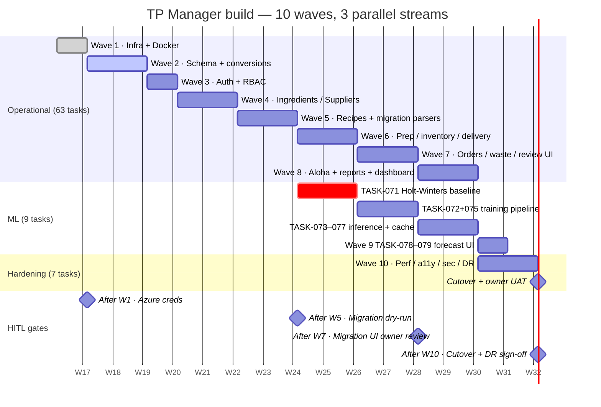

# Parallel Execution Board — 86 tasks for a small dev team

> **Source artefacts:** [tasks.md](../tasks.md) · [execution-schedule.json](../execution-schedule.json)
> **Purpose:** show, per wave, which clusters of tasks can be picked up *in parallel* without two engineers editing the same file at the same time. Also gives a default 3-person split.
> **Date:** 2026-04-18

---

## 1. Timeline view — waves × streams (Gantt)

Key idea: the operational stream runs continuously Waves 1→8; the ML stream opens at Wave 6 and reconverges at Wave 9; hardening waits for Wave 8 to finish.

---

## 2. Stream ownership at a glance

| Stream | Tasks | Skills | Who (suggested) |
|---|---|---|---|
| **operational** | 63 (TS + Postgres + PWA) | Full-stack TS, Fastify, Prisma, React | **Dev A (tech lead)** + **Dev B** |
| **ml** | 9 (Python) | statsmodels, scikit-learn, FastAPI | **Dev C** (0.6 FTE) |
| **hardening** | 7 (audit + ops) | Perf, a11y, security, DR, docs | All devs rotate in Wave 10 |

Total 2.6 FTE over ~18 weeks = spec v1.6 envelope.

---

## 3. Per-wave work slate

Each wave below lists **independent work slates** — sets of tasks that do not touch the same files and can be done in parallel by different engineers. Within a slate, TEST tasks block IMPL tasks (TDD rule).

### Wave 1 — Infra + Docker scaffold (3 slots, ~1 week) ✅ DONE

| Slate | Tasks | File surface | Blocks on | Owner |
|---|---|---|---|---|
| **1A Monorepo + services** | TASK-001, 002, 011, 014 | root configs, `apps/*`, `packages/*`, `docs/adr/`, README | — | Dev A |
| **1B Docker + compose + smoke tests** | TASK-003, 004, 005, 006 | `*/Dockerfile`, `docker-compose.yml`, `ops/tests/` | 1A (needs service skeletons) | Dev B |
| **1C IaC + CI/CD + observability + feature flags** | TASK-007, 008, 009, 010, 012, 013 | `infra/bicep/`, `.github/workflows/`, `ops/observability/`, `apps/api/src/feature-flags/` | 1A | Dev A (Bicep) + Dev B (CI) |

**HITL gate after:** owner provisions Azure creds. Unblocks 1C PARTIALs.

---

### Wave 2 — Schema + conversions + audit (3 slots, ~2 weeks)

| Slate | Tasks | File surface | Blocks on | Owner |
|---|---|---|---|---|
| **2A Conversions package** | TASK-015, 016, 017 | `packages/conversions/src/` | — | Dev B |
| **2B Schema + audit triggers** | TASK-018, 019, 020, 021, 022 | `apps/api/prisma/`, `apps/api/migrations/` | — | Dev A |
| **2C Multi-tenant lint + seeded utensils + shared types** | TASK-023, 024, 025 | `apps/api/seed/`, `packages/types/src/`, `eslint.config.js` | 2B (needs schema for seeding) | Dev B |

**File-conflict note:** `schema.prisma` is touched by 018 *and* 021 — sequenced inside slate 2B so only one dev holds the file at a time.

---

### Wave 3 — Auth + RBAC (2 slots, ~1 week)

| Slate | Tasks | File surface | Blocks on | Owner |
|---|---|---|---|---|
| **3A Auth backend (TDD)** | TASK-026, 027, 028 → TASK-029, 030 | `apps/api/src/auth/`, `apps/api/src/rbac/`, tests | 2B + 2C | Dev A |
| **3B PWA login screens** | TASK-031 | `apps/web/src/pages/login/`, forgot-password | 3A (needs endpoints) | Dev B |

Short wave; 3B can start as soon as 3A's endpoints compile (contract mocked).

---

### Wave 4 — Ingredients + Suppliers + Settings (3 slots, ~1.5 weeks)

| Slate | Tasks | File surface | Blocks on | Owner |
|---|---|---|---|---|
| **4A Ingredients** | TASK-032 → 033 | `apps/api/src/ingredients/` | 2B | Dev A |
| **4B Suppliers** | TASK-034 → 035 | `apps/api/src/suppliers/` | 2B | Dev B |
| **4C Settings (locations/UoMs/stations/waste-reasons/par-levels)** | TASK-036 | `apps/api/src/settings/` | 2B | Dev A or B (split sub-modules) |
| **4D PWA screens** | TASK-037 | `apps/web/src/pages/{ingredients,suppliers,settings}/` | 4A, 4B, 4C | Dev B (+ designer review) |

---

### Wave 5 — Recipes + station views + migration parsers (4 slots, ~1.5 weeks — **largest wave**)

| Slate | Tasks | File surface | Blocks on | Owner |
|---|---|---|---|---|
| **5A Recipes engine (TDD)** | TASK-038, 039 → 040, 041 | `apps/api/src/recipes/` | 2A + 4* | Dev A |
| **5B Recipes PWA + station PDF** | TASK-042 | `apps/web/src/pages/recipes/`, `apps/web/src/pages/station/` | 5A | Dev B |
| **5C Migration parsers (8 files)** | TASK-043, 044, 045 → 046, 047 | `apps/api/src/migration/parsers/` | 2B | Dev A or a third dev |
| **5D Fixtures pinning** | TASK-048 | `ops/fixtures/` (SAS-signed Blob) | — | Dev C (or PARTIAL — needs Blob access) |

**HITL gate after:** migration dry-run — owner confirms parser output on a real file snapshot before Wave 6.

**Task-gen advisory #5:** Wave 5 is flagged as a split candidate if the team is 2 people (not 3). In that case, push TASK-046/047 (parsers + staging engine) to a follow-on wave and keep 5A + 5B only.

---

### Wave 6 — Operational loop start // ML kickoff (4 slots, ~1.5 weeks)

| Slate | Tasks | Stream | Owner |
|---|---|---|---|
| **6A Prep sheet** | TASK-049 → 052 | operational | Dev A |
| **6B Inventory count (pause/resume offline-safe)** | TASK-050 → 053 | operational | Dev B |
| **6C Deliveries** | TASK-051 → 054 | operational | Dev A |
| **6D PWA screens** | TASK-055 | operational | Dev B |
| **6E ML baseline** | TASK-071 | ml | Dev C |

6A–6C are independent modules and can truly run in parallel (different directories, different tables). 6D waits on 6A–6C.

---

### Wave 7 — Orders + Waste + Migration review UI // ML training (4 slots, ~1.5 weeks)

| Slate | Tasks | Stream | Owner |
|---|---|---|---|
| **7A Orders** | TASK-056 → 059 | operational | Dev A |
| **7B Waste + partial-use handling** | TASK-057 → 060 → 062 (PWA) | operational | Dev B |
| **7C Migration review UI** | TASK-058 → 061 | operational | Dev A (after 7A) |
| **7D ML training pipeline** | TASK-072 → 075 | ml | Dev C |

**HITL gate after:** owner reviews migration UI before real batches are promoted to prod.

---

### Wave 8 — Aloha + Reports + Dashboard // ML inference (4 slots, ~2 weeks)

| Slate | Tasks | Stream | Owner |
|---|---|---|---|
| **8A Aloha worker + mapping UI + heartbeat** | TASK-063, 064 → 066, 067, 068 | operational | Dev A |
| **8B Reports (AvT, Price Creep, Waste)** | TASK-065 → 069 | operational | Dev B |
| **8C Dashboard** | TASK-070 | operational | Dev B (after 8B) |
| **8D ML inference + cache + proxy** | TASK-073, 074 → 076, 077 | ml | Dev C |

---

### Wave 9 — ML wrap + integration (2 slots, ~1 week)

| Slate | Tasks | Stream | Owner |
|---|---|---|---|
| **9A Forecast badge + accuracy dashboard** | TASK-078 | ml + frontend | Dev B + Dev C pair |
| **9B Wire forecast into prep sheet + ordering screens** | TASK-079 | integration | Dev A |

First wave where ML reconverges with the operational track.

---

### Wave 10 — Cutover + Hardening (3 slots, ~2 weeks)

| Slate | Tasks | Stream | Owner |
|---|---|---|---|
| **10A Automated audits** | TASK-080, 081, 083, 085 | hardening | Dev A + Dev B (parallel) |
| **10B Human-sweep audits** | TASK-082 (a11y), TASK-084 (DR drill) | hardening | Owner + Dev A present |
| **10C Cutover** | TASK-086 | hardening | All-hands |

**HITL gate after:** owner UAT on migration review + DR drill sign-off + prod promotion.

---

## 4. Default 3-person split (suggested)

| Person | Primary stream | Secondary | Covers |
|---|---|---|---|
| **Dev A — tech lead / full-stack TS** | operational backend | IaC + auth + recipes engine + Aloha worker | 35 tasks |
| **Dev B — full-stack TS (PWA-lean)** | operational frontend + services | supporting backend modules + reports + dashboard | 28 tasks |
| **Dev C — Python / data (0.6 FTE)** | ml | fixtures, accuracy dashboard | 9 tasks + Wave 10 assist |
| *All rotate* | hardening | Wave 10 audits | 14 tasks |

If the team is **2 people** (no Dev C): ML slips to post-operational per DEC-011 — Waves 6–8 shed the ML slates, Wave 9 becomes the whole ML wrap, Wave 10 cutover still goes but ship without forecast accuracy dashboard (can follow in a 0.1 release).

---

## 5. File-conflict resolution summary

From `execution-schedule.json` — the three shared files that multiple tasks touch, and how ordering keeps them safe:

| File | Tasks | Rule |
|---|---|---|
| `apps/api/prisma/schema.prisma` | TASK-018, 021 | Both in Wave 2 — 021 runs after 020 passes so the audit-trigger migration is additive over 019's init. |
| `apps/web/src/pages/*` | TASK-031, 037, 042, 055, 062, 070 | Each wave lands a new subdirectory; no cross-task overlap within a wave. |
| `apps/api/src/migration/*` | TASK-046, 047, 061 | 046 + 047 land together in Wave 5; 061 (review UI) is a full wave later. |

---

## 6. How to use this board

- **Start-of-wave ritual:** product owner picks a wave; each dev claims one slate (Dev A picks first, then Dev B, then Dev C).
- **Mid-wave:** if a dev unblocks early, they pair on the next slate rather than start the next wave (avoids file conflicts with devs still finishing).
- **End-of-wave:** all slates green → HITL gate (if scheduled for that wave) → next wave starts.
- **Blocked?** Re-read the matching slate row for `Blocks on` and confirm the upstream is green before starting.
