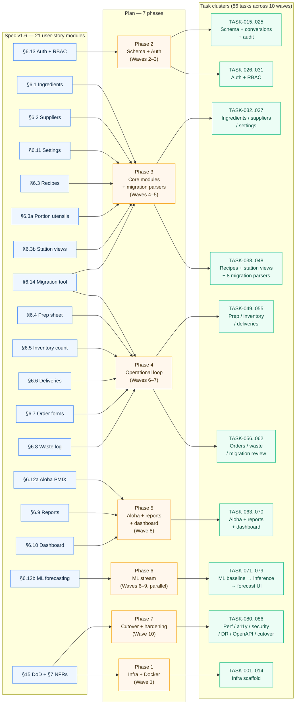

# Traceability Matrix — User Story → Plan Phase → Task

> **Source artefacts:** [spec v1.6](../../../product-owner/feature-intake/spec.md) · [plan](../../../architect/design-to-plan/plan.md) · [tasks.md](../tasks.md) · [execution-schedule.json](../execution-schedule.json)
> **Date:** 2026-04-18
> **Read as:** every user-story module in the spec traces to exactly one or more plan phases, and each phase fans out to a bounded set of TASK-IDs. Nothing in tasks.md is orphaned; nothing in the spec is uncovered.

---

## 1. End-to-end flow (spec → plan → tasks)

---

## 2. Module-level coverage table

Dense matrix — one row per spec module, showing exactly which tasks cover the Tests and the Implementation for its acceptance criteria.

| Spec | Module | Plan phase | Wave(s) | Test tasks | Implement tasks | Frontend | Coverage |
|---|---|---|---|---|---|---|---|
| §6.13 | Auth + RBAC | Phase 2 | 3 | TASK-026, 027, 028 | TASK-029, 030 | TASK-031 | ✅ |
| §6.1 | Ingredients | Phase 3 | 4 | TASK-032 | TASK-033 | TASK-037 | ✅ |
| §6.2 | Suppliers | Phase 3 | 4 | TASK-034 | TASK-035 | TASK-037 | ✅ |
| §6.11 | Settings | Phase 3 | 4 | — (covered by 032/034) | TASK-036 | TASK-037 | ✅ |
| §6.3 | Recipes | Phase 3 | 5 | TASK-038 | TASK-040, 041 | TASK-042 | ✅ |
| §6.3a | Portion utensils | Phase 2 + 3 | 2, 5 | TASK-016, 039 | TASK-017, 023, 040 | TASK-042 | ✅ |
| §6.3b | Station views | Phase 3 | 5 | TASK-039 | (in 040) | TASK-042 | ✅ |
| §6.14 | Migration tool | Phase 3 + 4 | 5, 7 | TASK-043, 045, 058 | TASK-046, 047 | TASK-061 | ✅ |
| §6.4 | Prep sheet | Phase 4 | 6 | TASK-049 | TASK-052 | TASK-055 | ✅ |
| §6.5 | Inventory count | Phase 4 | 6 | TASK-050 | TASK-053 | TASK-055 | ✅ |
| §6.6 | Deliveries | Phase 4 | 6 | TASK-051 | TASK-054 | TASK-055 | ✅ |
| §6.7 | Order forms | Phase 4 | 7 | TASK-056 | TASK-059 | (in 059) | ✅ |
| §6.8 | Waste log | Phase 4 | 7 | TASK-057 | TASK-060 | TASK-062 | ✅ |
| §6.12a | Aloha PMIX | Phase 5 | 5, 8 | TASK-044, 063, 064 | TASK-046, 066, 068 | TASK-067 | ✅ |
| §6.9 | Reports | Phase 5 | 8 | TASK-065 | TASK-069 | (in 069) | ✅ |
| §6.10 | Dashboard | Phase 5 | 8, 10 | TASK-080 | TASK-070 | TASK-070 | ✅ |
| §6.12b | ML forecasting | Phase 6 | 6–9 | TASK-071, 072, 073, 074 | TASK-075, 076, 077, 079 | TASK-078 | ✅ |
| §8 | Domain model | Phase 2 | 2 | TASK-020, 022 | TASK-018, 019, 021, 024 | — | ✅ |
| §7 | NFRs | Phase 7 | 10 | TASK-081, 082, 083 | cross-cutting | — | ✅ |
| §15 | DoD — restore drill | Phase 7 | 10 | TASK-084 | — | — | ✅ |
| §15 | DoD — cutover | Phase 7 | 10 | TASK-080 | TASK-086 | — | ✅ |
| §15 | DoD #12 heartbeat | Phase 5 | 8 | (in 063) | TASK-068 | — | ✅ |
| §10 | Docker deployment unit | Phase 1 | 1 | TASK-005, 006 | TASK-003, 004 | — | ✅ |

**Orphan check:** 0 tasks without a spec trace, 0 modules without task coverage.

---

## 3. Reverse lookup — "which tasks does this user story touch?"

Useful when the owner asks "what do you have to do to deliver AC §6.8 (waste log)?"

| Spec section | Tasks | Waves |
|---|---|---|
| §6.1 Ingredients | 032, 033, 037 | 4 |
| §6.2 Suppliers | 034, 035, 037 | 4 |
| §6.3 Recipes | 038, 039, 040, 041, 042 | 5 |
| §6.3a Portion utensils | 016, 017, 023, 039, 040, 042 | 2, 5 |
| §6.3b Station views | 039, 042 | 5 |
| §6.4 Prep sheet | 049, 052, 055, 079 *(forecast advisory)* | 6, 9 |
| §6.5 Inventory count | 050, 053, 055 | 6 |
| §6.6 Deliveries | 051, 054, 055 | 6 |
| §6.7 Order forms | 056, 059, 079 *(forecast advisory)* | 7, 9 |
| §6.8 Waste log | 057, 060, 062 | 7 |
| §6.9 Reports | 065, 069 | 8 |
| §6.10 Dashboard | 070, 080 | 8, 10 |
| §6.11 Settings | 036, 037 | 4 |
| §6.12a Aloha PMIX | 044, 046, 048, 063, 064, 066, 067, 068 | 5, 8 |
| §6.12b ML forecasting | 071–079 | 6–9 |
| §6.13 Auth + RBAC | 026, 027, 028, 029, 030, 031 | 3 |
| §6.14 Migration tool | 043, 045, 046, 047, 048, 058, 061 | 5, 7 |

---

## 4. How to read this matrix as the product owner

- **A module row is red-flagged** if `Test tasks` is empty and the module has acceptance criteria — would signal a TDD violation. None exist today.
- **A module that spans multiple phases** (e.g. §6.14 Migration tool touches Phase 3 + 4) is delivered in layers: first the parsers + staging engine, then the review UI a wave later. That's a deliberate split, not a design smell.
- **Front-end tasks (PWA screens) are always PARTIAL** in the agent-readiness column — they need design-polish judgement a human has to make.
- **The ML stream (§6.12b)** can slip Waves 6–9 without blocking the operational MVP per DEC-011; treat it as a parallel track, not a blocker.
